# Laris POS — Point of Sale untuk Coffee Shop & Restoran

Sistem Point of Sale (POS) yang lengkap untuk bisnis F&B — ditenagai **Next.js 16**, **Prisma**, dan **SQLite**. Mendukung alur kasir, dapur, manajemen inventori, hingga **pemesanan mandiri via QR code meja**.

> Dibangun untuk kebutuhan warung/kafe/resto Indonesia: pembayaran tunai & **QRIS (Midtrans)**, pajak + service charge, diskon, laporan harian.

---

## ✨ Fitur Utama

### 🖥️ Point of Sale (POS)
- Kasir cepat: tap menu → masuk keranjang → bayar
- Mode **Dine In / Takeaway**, pilih meja
- Diskon **(% / Rp)**, pajak, dan service charge otomatis
- Pembayaran **Tunai** (dengan hitung kembalian) & **QRIS** (Midtrans Snap)
- Cetak struk (invoice)

### 👨‍🍳 Kitchen Display System (KDS)
- Pesanan masuk real-time (SSE) ke dapur
- Alur status: **Diterima → Disiapkan → Siap → Selesai** (FIFO)
- Tampilan terpisah per meja

### ☕ Manajemen Menu & Inventori
- Kelola **kategori** dan **menu** (upload gambar via Cloudinary)
- Harga, deskripsi, status tersedia/habis
- **Stok** per item + ambang batas stok rendah (low-stock)

### 🍽️ Meja & QR Code
- Kelola nomor meja & kapasitas
- Generate **QR code per meja**
- Pelanggan scan QR → pesan sendiri via halaman `/order/[outlet]/[meja]`

### 📋 Pesanan
- Lihat semua pesanan (filter status & tipe)
- **Detail pesanan** lengkap per transaksi
- **Refund** pesanan

### 📊 Laporan & Pengaturan
- Dashboard ringkasan omzet, jumlah pesanan, produk terlaris
- **Export CSV** data pesanan
- Kelola **staff & role** (admin / kasir / dapur), atur PIN login
- Pengaturan outlet: **pajak & service charge**

### 🔐 Autentikasi
- Login dengan **nama + PIN** (hash bcrypt)
- Role-based access: tampilan & halaman disesuaikan per role

---

## 🧰 Tech Stack

| Layer      | Teknologi |
|-----------|-----------|
| Framework  | Next.js 16 (App Router, Turbopack) |
| Frontend   | React 19, Tailwind CSS 4, lucide-react |
| Database   | SQLite + Prisma ORM 5 |
| Auth       | JWT (jose) + bcryptjs |
| Payment    | Midtrans Snap (QRIS/Virtual Account) |
| Upload     | Cloudinary + browser-image-compression |
| Lainnya    | QR Code (qrcode), Server-Sent Events |

---

## 📸 Screenshot

### POS / Kasir
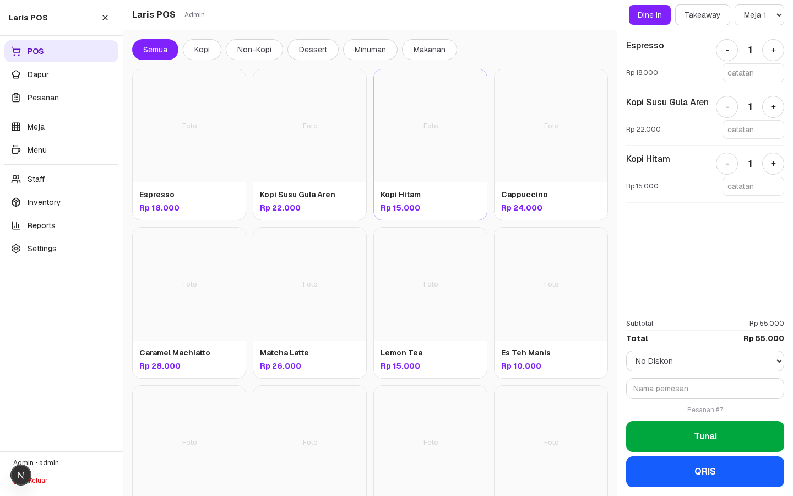

### Manajemen Menu
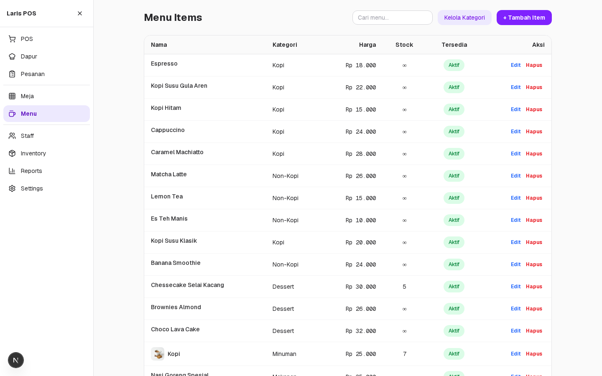

### Kitchen Display
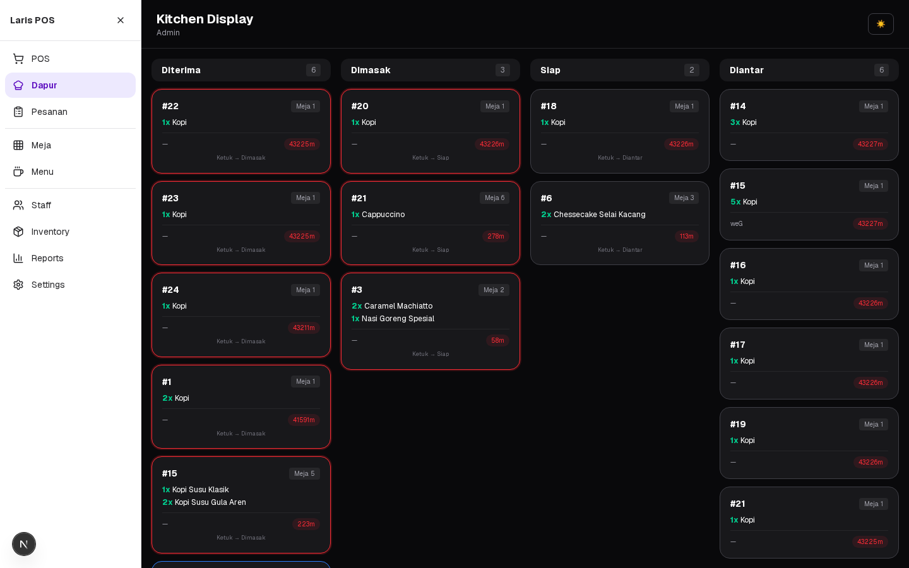

### Daftar Pesanan
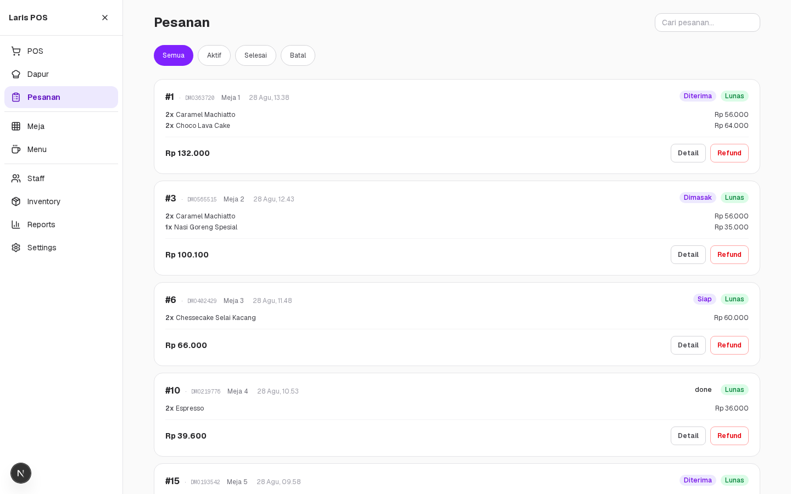

### Detail Pesanan
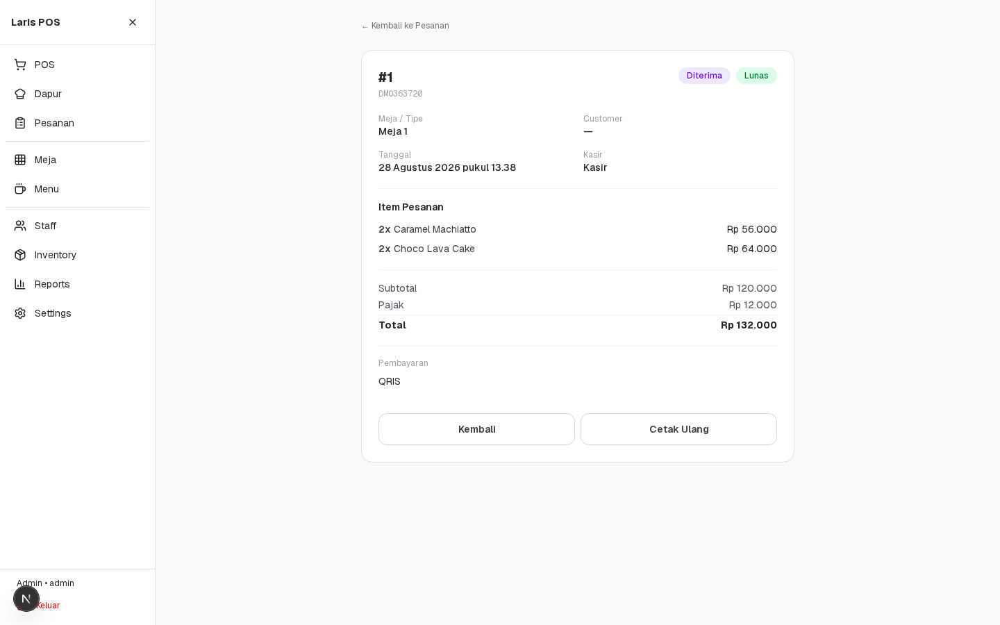

### Pemesanan Mandiri Pelanggan (via QR meja)
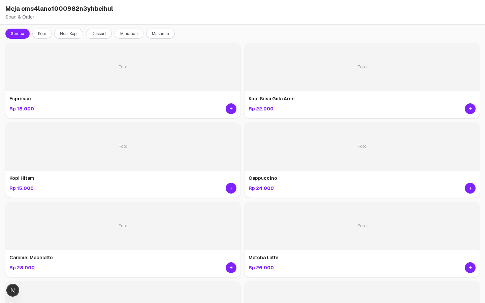

### Inventori
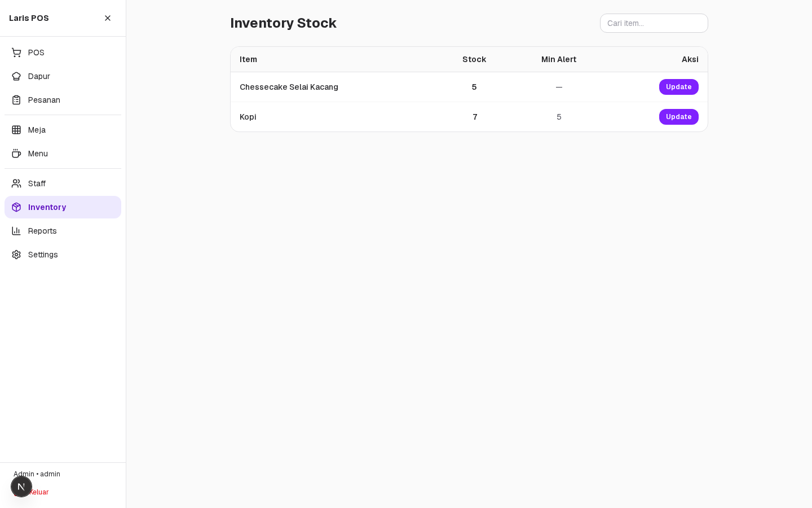

### Meja & QR
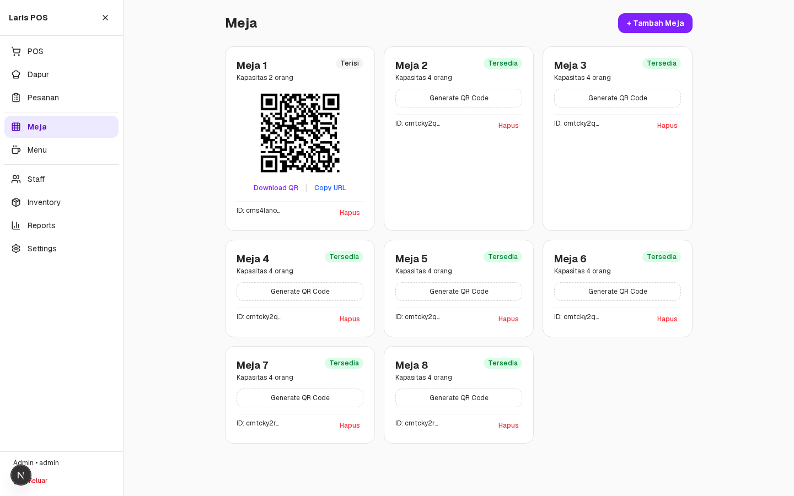

### Laporan
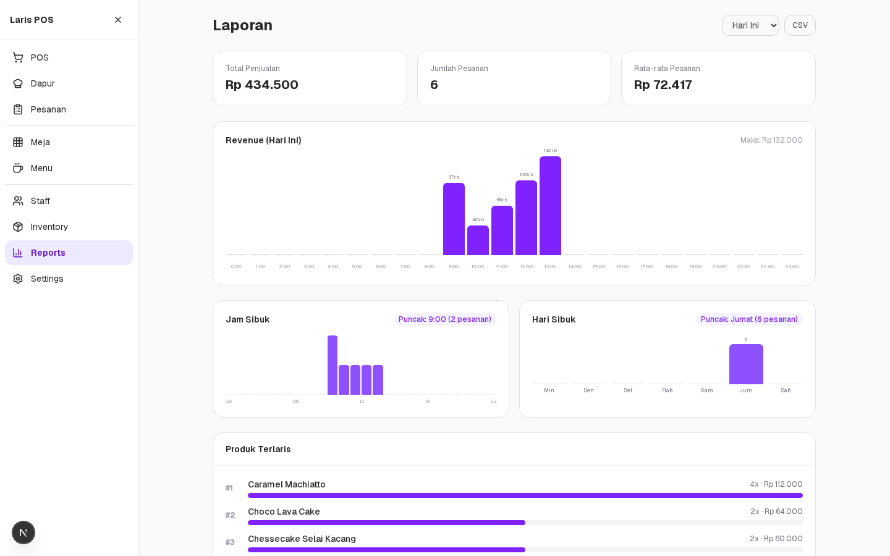

### Manajemen Staff
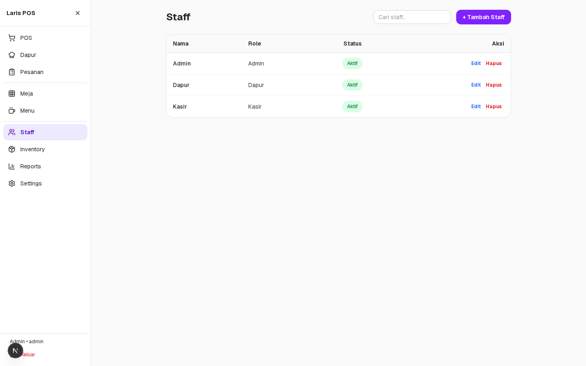

### Pengaturan Outlet
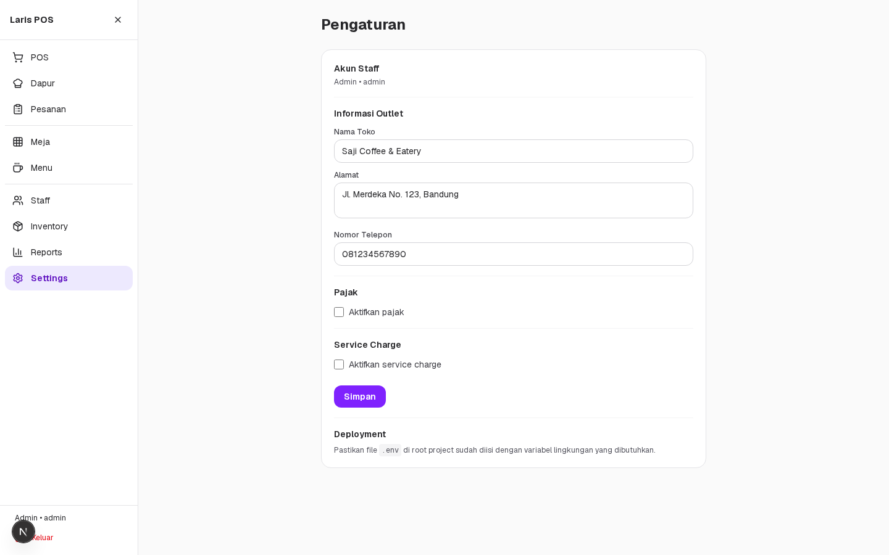

### Halaman Login
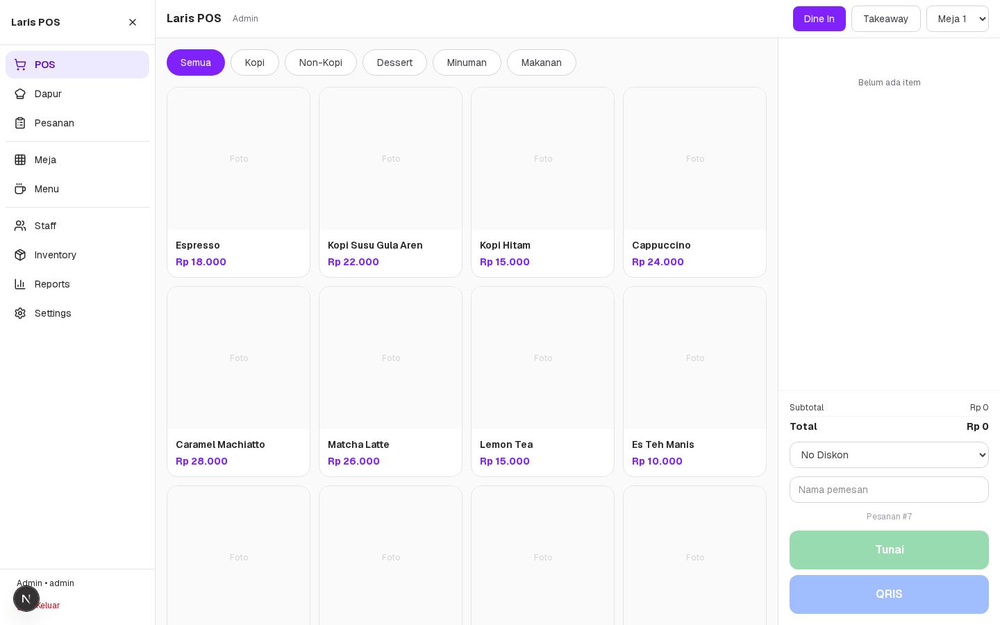

---

## 🚀 Menjalankan Secara Lokal

Prasyarat: **Node.js 20+** dan **pnpm** (atau npm/yarn).

```bash
# 1. Install dependensi
pnpm install

# 2. Siapkan env — salin template (isi kosong) lalu isi
#    DATABASE_URL: SQLite (default: file:./dev.db)
#    JWT_SECRET: kunci rahasia JWT (wajib, ganti ke string acak)
#    CLOUDINARY_*: opsional, untuk upload gambar menu
#    MIDTRANS_*: opsional, untuk pembayaran QRIS
cp env.example .env

# 3. Siapkan database & migrasi
pnpm prisma migrate dev

# 4. (Opsional) Isi data demo — outlet "Saji Coffee & Eatery", staff, menu, meja
node prisma/seed-demo.mjs

# 5. Jalankan dev server
pnpm dev
# buka http://localhost:3000
```

Login default dari seed:

| Role    | Nama | PIN |
|---------|------|-----|
| Admin   | Admin | 111111 |
| Kasir   | Kasir | 111111 |
| Dapur   | Dapur | 111111 |

---

## 📁 Struktur Proyek

```
src/
├── app/
│   ├── (customer)/order/[outletId]/[tableId]/   # self-order via QR
│   ├── (staff)/                                  # area staff (auth)
│   │   ├── pos/    kitchen/    orders/
│   │   ├── menu/   inventory/  tables/
│   │   ├── staff/  reports/    settings/
│   │   └── login/
│   └── api/                                       # REST API (Prisma)
│       ├── auth/        orders/   menu/
│       ├── categories/  inventory/  tables/
│       ├── staff/       reports/  outlets/
│       ├── payment/     upload/
│       └── orders/sse   # realtime kitchen
├── components/          # UI bersama (toast, skeleton, dll)
├── lib/                 # auth, prisma, db helper
prisma/
├── schema.prisma        # model: Outlet, Staff, MenuItem, Order, OrderItem...
└── seed-demo.mjs        # data demo (outlet, staff, menu, meja, order)
```

---

## 🗂️ Lisensi

Proyek pribadi — bebas digunakan & dikembangkan. Dibuat dengan ❤️ untuk usaha F&B.
